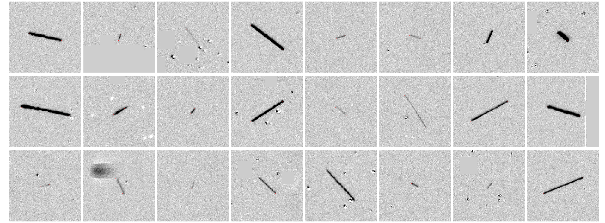

# DeepStreaks: identifying fast-moving near-Earth Objects in the Zwicky Transient Facility (ZTF) data with deep learning

DeepStreaks is a convolutional neural-network, deep-learning system designed to efficiently identify 
streaking fast-moving near-Earth objects that are detected in the data of the 
[Zwicky Transient Facilty (ZTF)](https://ztf.caltech.edu), a wide-field, time-domain survey using a 
dedicated 47 square degrees camera attached to the Samuel Oschin 48-inch Telescope at the Palomar Observatory
in California, United States. The system demonstrates a 96-98% true positive rate, depending on the night, 
while keeping the false positive rate below 1%. The sensitivity of DeepStreaks is quantified by the 
performance on the test data sets as well as using known near-Earth objects observed by ZTF. 
The system is deployed and adapted for usage within the ZTF Solar-System framework and has 
significantly reduced human involvement in the streak identification process, from several hours to 
typically under 10 minutes per day.

As of June 1, 2019 DeepStreaks has discovered 35 near-Earth asteroids.

For details, please see [Duev et al., MNRAS.486.4158D, 2019](https://academic.oup.com/mnras/article-abstract/486/3/4158/5472913).

[arXiv:1904.05920](https://arxiv.org/pdf/1904.05920.pdf)

Note that this repository contains pre-trained models used in DeepStreaks (total size: ~280 MB).

## Models: architecture, data, training, and performance

### Network architecture

We are using three "families" of binary CNN-based classifiers. Individual classifiers from each such family are trained 
to answer one of the following questions, respectively:

- "rb": bogus (rb=0) or real (rb=1) streak? All streak-like objects are marked as real, including actual streaks from 
fast moving objects, long streaks from satellites, and cosmic rays.

- "sl": long (sl=0) or short (sl=1) streak? 

- "kd": ditch (kd=0) ot keep (kd=1)? Is this a real streak, or a cosmic ray/some other artifact?

For a streak to be declared a plausible candidate, for each family, the scores from at least one family member must
be above the corresponding threshold (threshold_rb=0.5, threshold_sl=0.5, threshold_kd=0.5)


Input image dimensions - `144x144x1` (gray scale).

The models are implemented using `Keras` with a `TensorFlow` backend (GPU-enabled). 


### Data sets

The data were prepared using [Zwickyverse](https://github.com/dmitryduev/zwickyverse).

As of February 2019, the training set for the "rb" classifiers contains 11,857 streak and 13,449 non-streak images; 
for the "sl" classifiers -- 5,168 long and 11,246 short streak images; 
for the ""kd" classifiers -- 14,154 "false" and 10,621 "true" images

### Training and performance

The models were trained on-premise at Caltech on a Nvidia Tesla P100 GPU (12G) 
for about 200-300 epochs with a mini-batch size of 32 (see `deepstreaks.py` for the details).

#### Training and validation accuracies


#### ROC curves


#### Confusion matrices


#### A Venn diagram of the number of streaks that pass DeepStreaks' sub-filters.


#### Examples of real Near-Earth Objects identified by DeepStreaks



#### Completeness of DeepStreaks detection using known NEAs observed by ZTF in October 2018 – January 2019. 

Out of 210 streaks from real NEAs detected by the ZTF Streak pipeline at IPAC, 202 (96%) are correctly classified.


---

## Production service  

### Set-up instructions

#### Pre-requisites

Clone the repo and cd to the `service` directory:
```bash
git clone https://github.com/dmitryduev/DeepStreaks.git
cd DeepStreaks/service
```

Create `secrets.json` with the admin user/password for the web app:
```json
{
  "database": {
    "admin_username": "ADMIN",
    "admin_password": "PASSWORD"
  }
}
```

#### Using `docker-compose` (for production)

Change `rico.caltech.edu` in `docker-compose.yml` and in `traefik/traefik.toml` to your domain. 

Run `docker-compose` to start the service:
```bash
docker-compose up --build -d
```

To tear everything down (i.e. stop and remove the containers), run:
```bash
docker-compose down
```

---

#### Using plain `Docker` (for dev/testing)

If you want to use `docker run` instead:

Create a persistent Docker volume for MongoDB and to store data:
```bash
docker volume create deep-asteroids-mongo-volume
docker volume create deep-asteroids-volume
```

Launch the MongoDB container. Feel free to change u/p for the admin, 
but make sure to change `config.json` correspondingly.
```bash
docker run -d --restart always --name deep-asteroids-mongo -p 27023:27017 -v deep-asteroids-mongo-volume:/data/db \
       -e MONGO_INITDB_ROOT_USERNAME=mongoadmin -e MONGO_INITDB_ROOT_PASSWORD=mongoadminsecret --no-cache\
       mongo:latest
```

Build and launch the app container:
```bash
docker build --rm -t deep-asteroids:latest -f Dockerfile .
# rico production:
docker run --runtime=nvidia -e NVIDIA_VISIBLE_DEVICES=0 --name deep-asteroids -d --restart always -p 8001:4000 -v /data/ztf/streaks:/data --link deep-asteroids-mongo:mongo deep-asteroids:latest
# rico test mode:
#docker run --rm -it --runtime=nvidia --name deep-asteroids -p 8001:4000 -v /data/ztf/streaks:/data --link deep-asteroids-mongo:mongo deep-asteroids:latest
# private:
#docker run --name deep-asteroids -d --restart always -p 8001:4000 -v /scratch/ztf/streaks:/data --link deep-asteroids-mongo:mongo deep-asteroids:latest
#docker run --name deep-asteroids -d --restart always -v /scratch/ztf/streaks:/data --link deep-asteroids-mongo:mongo deep-asteroids:latest
# test mode:
#docker run -it --rm --name deep-asteroids -p 8001:4000 -v deep-asteroids-volume:/data --link deep-asteroids-mongo:mongo deep-asteroids:latest
#docker run -it --rm --name deep-asteroids -p 8001:4000 -v /scratch/ztf/streaks:/data --link deep-asteroids-mongo:mongo deep-asteroids:latest
# test mode on Dima's mpb:
docker run -it --rm --name deep-asteroids -p 8001:4000 -v /Users/dmitryduev/_caltech/python/deep-asteroids/_tmp:/data --link deep-asteroids-mongo:mongo deep-asteroids:latest

```

The service will be available on port 8001 of the `Docker` host machine.
